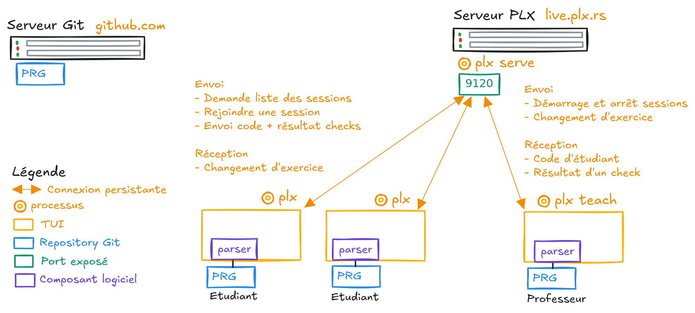

# Documentation de mon Travail de Bachelor (TB) sur PLX

> Concevoir une expérience d'apprentissage interactive à la programmation avec PLX

## Documents disponible
1. [Descriptif de l'idée pour GAPS](./descriptif-gaps.md) - Markdown - Rendu le 2024-11-18 pour le sytème de gestion des TBs
1. [Cahier des charges (cdc)](./cdc.md) - Markdown - Rendu le 2025-04-09
1. [Début de rédaction de l'état de l'art](./etatdelart.pdf) - Typst - En cours

## Schémas

Architecture haut-niveau - Excalidraw

