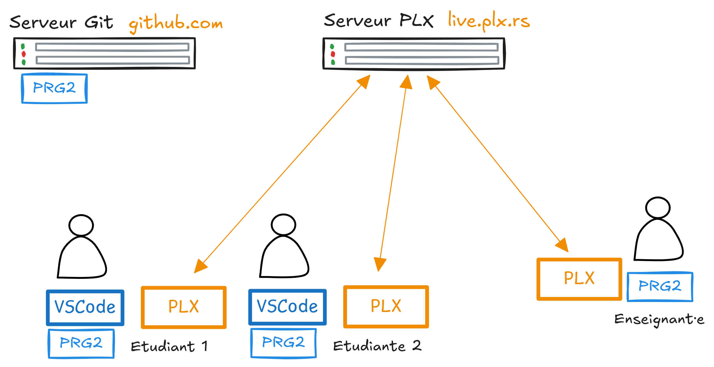
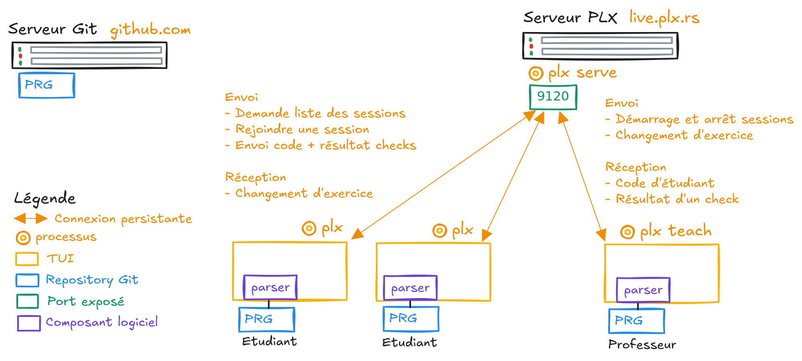
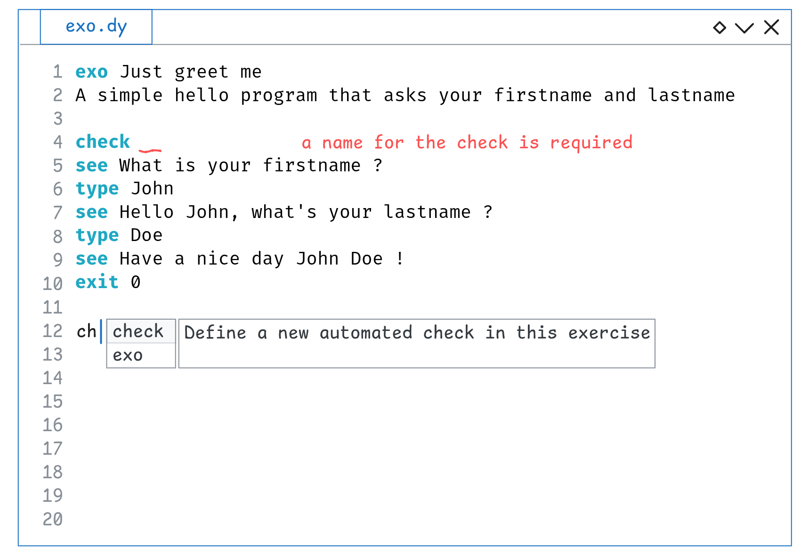
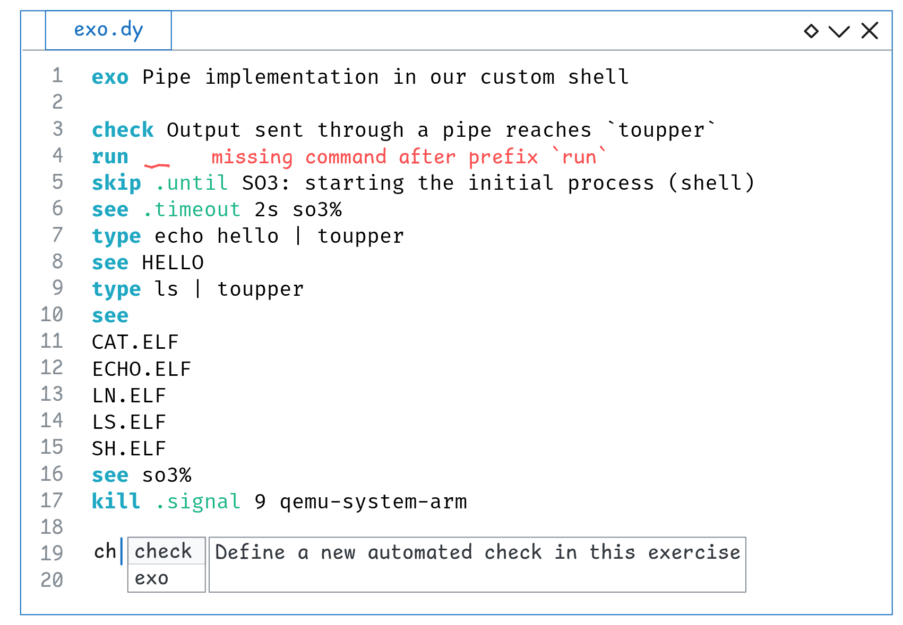

# Concevoir une expérience d'apprentissage interactive à la programmation avec PLX

> Documentation de mon Travail de Bachelor (TB) sur PLX

## Documents disponibles
1. [**Le rapport final**](report/rapport-final-tb-plx.pdf) - Typst - en cours de rédaction
1. [**L'affiche**](affiche) - en cours de finition
1. [Descriptif de l'idée pour GAPS](./preparation/descriptif-gaps.md) - Markdown - Rendu le 2024-11-18 pour le sytème de gestion des TBs
1. [Cahier des charges (cdc)](./preparation/cdc.md) - Markdown - Rendu le 2025-04-09
1. [Liste de POC des différentes technologies pour l'état de l'art](./pocs) - 5 POCs en Rust pour tester différentes crates

## Implémentation
L'implémentation de ces fonctionnalités sur PLX se fait dans un repository séparé sur [samuelroland/plx](https://github.com/samuelroland/plx/tree/live). L'implémentation du système de session live se fait sur la branche `live`. L'implémentation du parseur démarrera plus tard.

## Schémas

Sessions live - Excalidraw

Vue d'ensemble haut niveau d'une session live

Architecture réseau

Intégration IDE - Excalidraw

Exo basique

Exo plus avancé

## Archives

1. [Le rapport intermédiaire](report/rapport-intermediaire-tb-plx.pdf) - Typst - dans l'état du rendu intermédiaire du 2025-05-23 à 17h. Le rapport final est déjà meilleur que ce rapport au niveau de la contextualisation.
