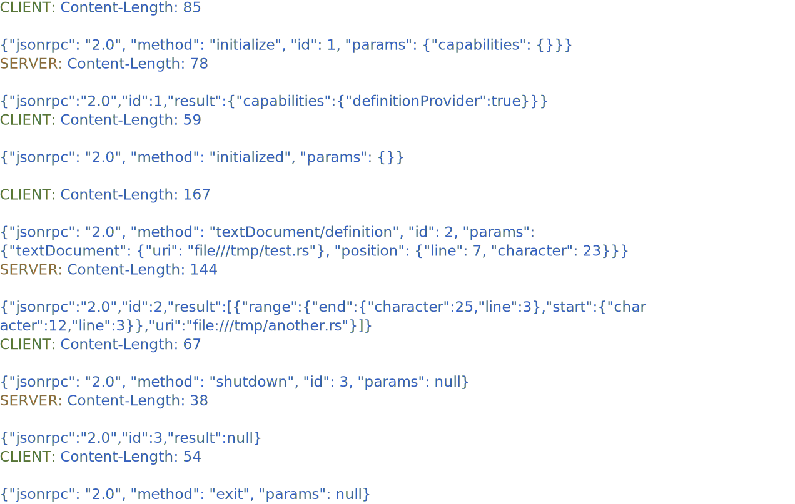
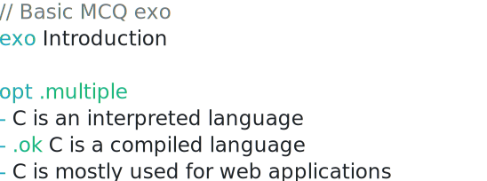

# Proof of Concepts

## Goal
Experimenting with different libraries and technologies around parsing, LSP, syntax highlighting, IDE integration and live communication. The quality of code is not the priority, speed and experimentation is the goal.

## POCs overview
1. **Parsers**
    1. Define a very basic syntax that has a 2 prefixes, 2 type of values (same line + list values), comment support, and a single boolean property. Only one object is defined, no blank lines authorized. File name `fish.dy`.
    1. [`naive-parser`](naive-parser/): Create a very basic hand-made parser in Rust (without any syntax abstractions, searching for literal prefixes) to parse this syntax into a Rust struct
    1. [`winnow-parser`](winnow-parser): Create another parser with Winnow, reuse tests suite, same features that `naive-parser`
    1. I had the idea at the start to create another POC with `chumsky`, but I gave up after deciding I was going to write a hand-made parser.
1. **Language server**: [`lsp-server-demo`](lsp-server-demo/) - A basic language server implementation with the create `lsp-server` that implement the "Go to definition"
1. **Syntax highlighting**: [`tree-sitter-poc-dy`](tree-sitter-poc-dy) A TreeSitter grammar to support syntax highlighting, without any abstraction, straight to the point and install it in Neovim. See how it can be used via the tree-sitter CLI.
1. **Live server**: [`websockets-json`](websockets-json) A live server POC that just allows to send code via a JSON message from a `student` to a `teacher` via a websocket server in the middle.

## Quick overview of the results
You can see way more details in the report, but here is a quick overview
- `naive-parser`:
    ```
    [src/main.rs:15:5] &result = ParseResult {
        exo: McqExo {
            title: "What is Fish ?",
            options: [
                "An animal in water",
                "Friendly Interactive Shell",
                "Yet another geek joke",
            ],
            correct_option_index: 1,
        },
        errors: [],
    }
    ```
- `winnow-parser` not finished
- `lsp-server-demo`
    
- `tree-sitter-poc-dy`  
    
- `websockets-json`: see report

## Simplified DY syntax
Instead of using the whole syntax with lot's of prefixes, we would like to describe basic MCQ exos (inspired by Delibay, another project which is the origin of this syntax). This is not the definitive syntax ! In a file called `fish.dy`, we write this
```
// Basic warmup exo
exo What is Fish ?
opt
- An animal in water
- .ok Friendly Interactive Shell
- Yet another geek joke
```
We have a comment line starting with `//`. The keyword `exo` introduces a new exercise, it is followed by the title. Then `opt` introduces a list of options for this question. This list contains 3 string values starting with a `-`, the correct option is defined by a property `.ok`, it must be present after the dash.

This MCQ exo must be parsed as this following Rust struct
```rust
struct McqExo {
    title: String,
    options: Vec<String>,
    correct_option_index: u8,
}
```

It we wanted to hardcode it, here is the struct usage

```rust
let fish_exo = McqExo {
    title: "What is Fish ?".to_string(),
    options: vec![
        "An animal in water".to_string(),
        "Friendly Interactive Shell".to_string(),
        "Yet another geek joke".to_string(),
    ],
    correct_option_index: 1,
};
```

If we wanted to export it in JSON, it would be

```json
{
    "title": "What is Fish ?",
    "options": [
        "An animal in water",
        "Friendly Interactive Shell",
        "Yet another geek joke"
    ],
    "correct_option_index": 1
}
```

### Possible errors
1. An empty line is forbidden, it should not block the parsing the raise an error in the IDE
1. A missing or empty title is not authorized (the `exo` prefix must be found and trimmed value should not be "")
1. Only one correct option is accepted, not less and not more
1. Double prefixes is incorrect
1. A line that starts with something else that a known prefix or a dash or `//` is invalid

