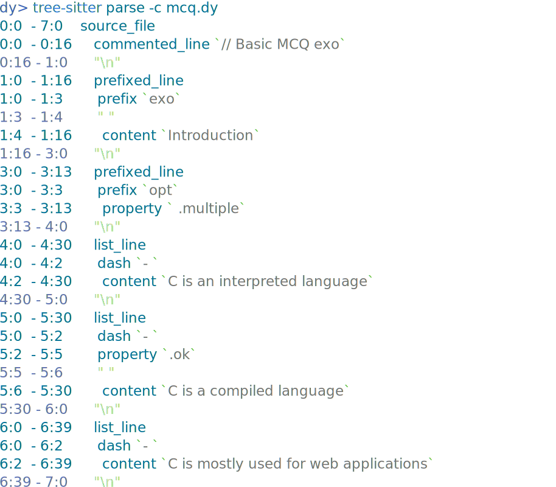

# A POC of Tree-Sitter

1. Checkout `grammar.js` and queries files under `queries/`
1. Run `tree-sitter generate && tree-sitter build`
1. Make sure to create a symlink named `tree-sitter-dy` to this folder, ex. `ln -s /path/to/tb-docs/pocs/tree-sitter-poc-dy tree-sitter-dy`. This symlink must be in a directory listed under `parser-directories` in your `~/.config/tree-sitter/config.json`.
1. Then `tree-sitter langs` should list `source.dy`
1. You can then highlight with `tree-sitter highlight dy/mcq.dy`, see other examples in `dy/` folder

## Preview

```
// Basic MCQ exo
exo Introduction

opt .multiple
- C is an interpreted language
- .ok C is a compiled language
- C is mostly used for web applications
```

`tree-sitter highlight dy/mcq.dy`



## TODO
- Figure out how to embbed Markdown highlighting into DY highlighting
- Figure out if it is possible to dynamically generate a `grammar.js` or the equivalent in JSON, based on the a list of keys and properties ?
